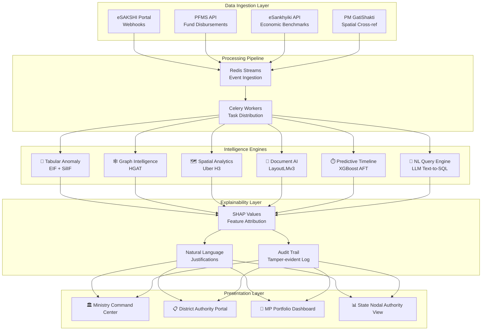
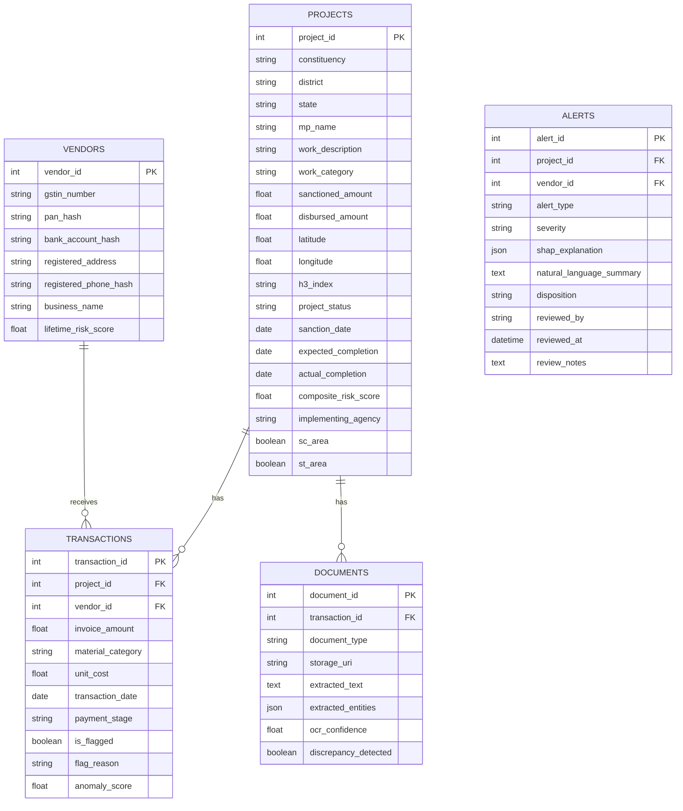
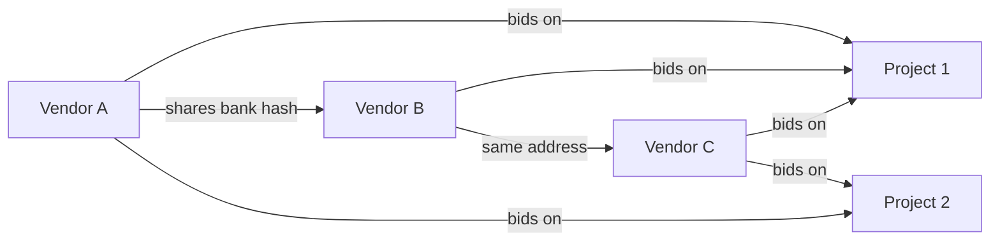
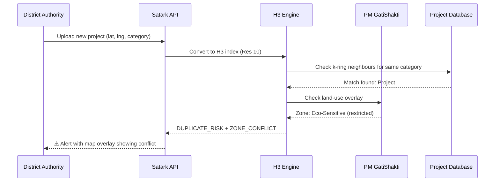
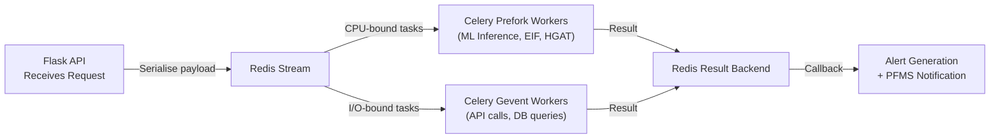

# SATARK-MPLAD

## An AI-Powered Blueprint for Intelligent Audit, Fraud Detection & Real-Time Governance in Public Infrastructure Spending

---

> **Smart India Hackathon 2026 — Problem Statement SIH26102**
> **Organisation:** Ministry of Statistics & Programme Implementation (MoSPI)
> **Category:** Software | **Theme:** GovTech / Public Finance Transparency
> **Data Source:** [MPLADS eSAKSHI Public Dashboard](https://mplads.mospi.gov.in/digigov/dashboard.html)

---

> [!IMPORTANT]
> **This is the single source of truth for the team.** Read this fully before writing any code. Every design decision, architectural choice, and task division is documented here. If something isn't in this document, it's not part of our plan.

---

## Table of Contents

1. [Executive Summary — The Idea in Brief](#1-executive-summary--the-idea-in-brief)
2. [Problem Statement (SIH26102, as issued)](#2-problem-statement-sih26102-as-issued)
3. [Understanding the Domain — Why This Is Hard](#3-understanding-the-domain--why-this-is-hard)
4. [Our Solution at a Glance](#4-our-solution-at-a-glance)
5. [Data Strategy & Sources](#5-data-strategy--sources)
6. [Core Intelligence Engines (Six Modules)](#6-core-intelligence-engines-six-modules)
7. [Backend Architecture](#7-backend-architecture)
8. [Frontend Architecture & UX](#8-frontend-architecture--ux)
9. [What Makes Satark-MPLAD Unique](#9-what-makes-satark-mplad-unique)
10. [Innovative Add-Ons & Stretch Features](#10-innovative-add-ons--stretch-features)
11. [Execution Plan & Team Structure](#11-execution-plan--team-structure)
12. [Demo Narrative — What the Judges Will See](#12-demo-narrative--what-the-judges-will-see)
13. [Risks & Mitigations](#13-risks--mitigations)
14. [Technology Stack Summary](#14-technology-stack-summary)
15. [References & Works Cited](#15-references--works-cited)

---

# 1. Executive Summary — The Idea in Brief

Every year, each Member of Parliament directs **₹5 crore** toward local development — drinking water systems, schools, health centres, roads — through the MPLADS scheme. Multiplied across both Houses of Parliament, this generates **thousands of concurrent works**, executed by **thousands of implementing agencies and vendors**, producing a volume of financial and project data that no team of human auditors can meaningfully review in real time.

Oversight today is largely **retrospective**: irregularities surface in Comptroller and Auditor General (CAG) reports *years* after the money has already moved. The eSAKSHI portal (launched April 2023) digitised the workflow — but digitisation without intelligence is just faster paperwork.

**Satark-MPLAD** (Hindi: सतर्क, meaning *"alert"* / *"vigilant"*) is our proposed answer:

> An AI-assisted monitoring and analytics platform that watches MPLADS data **as it is generated** — sanctions, expenditures, vendor payments, work-progress updates, geo-tagged photographs, and uploaded documents — and surfaces the specific patterns that history tells us precede fraud and inefficiency.

### What the platform detects:

| Fraud/Inefficiency Type | How We Detect It | AI Engine |
|---|---|---|
| **Cost inflation & split invoices** | Compares line-item unit costs against regional benchmarks; detects invoice-splitting below scrutiny thresholds | Extended Isolation Forest + SilIF |
| **Vendor cartels & bid-rigging** | Maps hidden relationships (shared bank accounts, addresses, PAN) across vendors | Heterogeneous Graph Attention Network |
| **Duplicate / ghost infrastructure** | Cross-references GPS coordinates of new works against all historical infrastructure within radius | Uber H3 Spatial Indexing |
| **Forged / altered documents** | Reads invoices, sanction orders, and DPRs holistically — text, layout, and visual features together | LayoutLMv3 Multimodal Transformer |
| **Project delays & cost overruns** | Predicts probability of deadline violation before it happens | XGBoost Accelerated Failure Time |
| **Fund parking & year-end spending spikes** | Detects sudden fund transfers that don't correlate with physical progress | Time-series anomaly detection |

### What separates us from a "generic AI dashboard":

1. **Every flag is explainable** — SHAP (SHapley Additive exPlanations) decomposes every risk score into individual signal contributions, generating audit-ready natural language justifications
2. **AI flags, humans decide** — the system never autonomously blocks a payment; it raises alerts with evidence for human authorities to act on
3. **Real data, not toy demos** — we ingest from the actual eSAKSHI public dashboard and eSankhyiki macroeconomic API, not fabricated CSV files
4. **Role-based dashboards** — tailored views for MPs, District Authorities, State Nodal Authorities, and the Ministry, each seeing exactly what their mandate requires

---

# 2. Problem Statement (SIH26102, as issued)

| Field | Detail |
|---|---|
| **PS Number** | SIH26102 |
| **Organisation** | Ministry of Statistics & Programme Implementation (MoSPI) |
| **Category** | Software |
| **Title** | AI-Powered MPLADS Fraud Detection & Monitoring System |

### Background

The Members of Parliament Local Area Development Scheme (MPLADS) is a Central Sector Scheme under which Hon'ble Members of Parliament recommend developmental works for creation of durable community assets and provision of basic civic amenities. The Scheme involves large-scale fund utilisation and execution of thousands of works across the country through multiple implementing agencies and administrative authorities. Given the volume and complexity of financial and project-related data generated under the Scheme, there is a need for an AI-powered solution that can leverage machine learning and advanced analytics to detect trends and anomalies in expenditure patterns, fund utilisation, cost estimates, and work execution, thereby enabling early identification of potential fraud, inefficiencies, and non-compliance while enhancing transparency, accountability, and effective monitoring of MPLADS works.

### Description

Develop an AI-powered monitoring and analytics platform for MPLADS that leverages Machine Learning (ML), Artificial Intelligence (AI), and advanced data analytics to identify trends, anomalies, irregularities, and potential fraud in fund utilisation and project execution. The solution should analyse data relating to sanctions, expenditures, cost estimates, work progress, payments, and asset creation to detect unusual patterns, cost overruns, duplicate works, delayed projects, and deviations from established norms. The system should generate risk-based alerts, predictive insights, and decision-support dashboards for Members of Parliament, State Nodal Authorities, District Authorities, and the Ministry. The platform should also facilitate automated compliance monitoring, trend analysis, and early warning mechanisms to improve transparency, accountability, and efficiency in the implementation of MPLADS works across the country.

### Expected Solution

The proposed solution should be an AI-powered platform that helps monitor MPLADS works and fund utilisation in a smarter and more efficient manner. By analysing data related to project approvals, expenditures, payments, work progress, and completion status, the system should be able to identify unusual patterns, delays, cost overruns, duplicate works, and potential cases of misuse of funds. It should automatically generate alerts and highlight high-risk cases that require attention from the concerned authorities. The platform should provide easy-to-understand dashboards and insights to Members of Parliament, State Nodal Authorities, District Authorities, and the Ministry, enabling them to make informed decisions and take timely corrective action. By leveraging artificial intelligence and data analytics, the solution should enhance transparency, strengthen accountability, reduce manual monitoring efforts, and support more effective implementation of MPLADS works across the country.

---

# 3. Understanding the Domain — Why This Is Hard

Before writing a line of detection logic, the whole team needs to share the same mental model of **how MPLADS actually works**. Building a convincing fraud-detection system requires understanding the real workflow well enough to know what *"normal"* looks like — that is the only way to recognise what is *not* normal.

## 3.1 How a Work Moves Through the System


**Step-by-step lifecycle:**

1. **MP Recommendation** — An Hon'ble MP recommends a developmental work and earmarks funds from their annual ₹5 crore entitlement, submitted online through the eSAKSHI portal
2. **District Authority Review** — The District Authority conducts feasibility checks and must sanction or reject the recommendation — by Scheme guidelines, generally within **45 days** — and designates the Implementing Agency (IA) responsible for execution
3. **Execution** — Sanctioned works are, as a norm, expected to be completed **within one year of sanction**
4. **Payment Flow** — The IA executes the work and raises vendor payment requests at each stage. Funds move through the **Public Financial Management System (PFMS)** via Central and State Nodal Agency (CNA/SNA) "just-in-time" disbursement, replacing the older system of localised bank accounts
5. **Evidence Upload** — At each payment stage, the IA must upload supporting evidence — **photographs of the asset** at that stage of completion and **documents such as sanction orders** — directly onto the portal
6. **Completion Marking** — Once the final payment is released, the IA must explicitly mark the work as "complete" on the portal. *Only works marked complete by the IA appear as completed on the public dashboard*
7. **Social Equity Mandate** — A minimum of **15% of funds must go to Scheduled Caste (SC) areas** and **7.5% to Scheduled Tribe (ST) areas**

## 3.2 Four Documented Vulnerability Vectors

Historical CAG reports and independent analyses converge on **four recurring patterns of leakage and inefficiency**. Each maps directly onto one of our detection engines.

### Vector 1: Financial Manipulation & Fund Parking

Historical audits indicate a pervasive culture where departments move unspent funds into commercial bank accounts operated by Drawing and Disbursing Officers (DDOs) or into state-level Virtual Personal Deposit (VPD) accounts to prevent the capital from lapsing at the end of the financial year. This accounting manoeuvre:
- **Creates severe distortion** in the state's true fiscal position
- **Artificially lowers** the reported revenue deficit
- **Renders billions of rupees idle** while communities wait for infrastructure
- **Triggers an extreme rush of expenditure in March**, leading to hurried, poorly planned outlays that circumvent standard scrutiny processes

> [!WARNING]
> Maharashtra CAG report (2024) flagged ₹thousands of crores in off-budget borrowing and parked funds, demonstrating this remains an active, systemic problem — not a historical artefact.

### Vector 2: Vendor Cartelisation & Bid-Rigging

Public procurement systems are highly vulnerable to collusive rings where ostensibly independent contractors secretly collaborate to bypass competitive tender thresholds. These cartels utilise **relation camouflage** — generating networks of shell companies that share hidden identifiers:
- Cross-registered directors
- Overlapping physical addresses
- Identical device fingerprints or bank accounts
- Coordinated bid amounts designed to guarantee a pre-selected "winner"

The result: **artificial inflation of project costs**, as the cartel ensures its designated winner secures the contract at a premium.

### Vector 3: Spatial Duplication & Ghost Infrastructure

A recurring challenge in multi-scheme developmental governance is **double-funding**: an implementing agency claims capital for a physical asset (e.g., a water filtration plant) under MPLADS, while simultaneously billing a state-level rural development fund for the exact same GPS coordinates. In more egregious instances, the infrastructure is **entirely fictional**, supported only by manipulated imagery.

### Vector 4: Time & Cost Overruns

The revised MPLADS Guidelines mandate that an Implementing District Authority must generally complete the work within one year. However, bureaucratic friction, delayed submission of Detailed Project Reports (DPRs), and contractor inefficiencies frequently cause projects to stall. As timelines extend, raw material costs escalate, resulting in requests for additional capital disbursements that erode the scheme's overall efficiency.

## 3.3 A Critical, Honest Data Limitation

> [!NOTE]
> The eSAKSHI portal itself states that recommendation and sanction data for the 17th Lok Sabha is available **only from financial year 2023-24 onward**; the four preceding years (2019-20 to 2022-23), when the Scheme still ran on physical file management, are not represented on the digital portal. Any historical trend analysis our engines compute must be built with this gap explicitly acknowledged.

---

# 4. Our Solution at a Glance

## 4.1 One-Paragraph Pitch

**Satark-MPLAD** is a modular, AI-powered oversight platform that ingests real-time MPLADS operational data from eSAKSHI, PFMS, and eSankhyiki, runs it through six specialised intelligence engines (tabular anomaly detection, graph-based cartel detection, geospatial deduplication, document intelligence, predictive timeline analysis, and natural-language querying), and delivers explainable, role-based risk alerts to all four stakeholder tiers — MPs, District Authorities, State Nodal Authorities, and the Ministry — through interactive, SHAP-backed decision-support dashboards.

## 4.2 System Architecture — High-Level View



## 4.3 Core Design Principles

| Principle | What It Means in Practice |
|---|---|
| **AI assists, never decides** | Every flag requires human review and approval before any administrative action |
| **Explainability first** | No "black box" scores — every alert comes with SHAP waterfall decomposition and natural language rationale |
| **Real data, real benchmarks** | Macroeconomic baselines sourced from eSankhyiki (WPI, CPI, regional labour indices), not hardcoded thresholds |
| **Privacy by design** | PII stored as cryptographic hashes — graph engines detect shared identities without exposing raw data |
| **Graceful degradation** | If any single engine fails or lags, the rest continue operating; no single point of failure |
| **Audit trail integrity** | Every alert, review, disposition, and override is logged in an append-only, tamper-evident ledger |

---

# 5. Data Strategy & Sources

## 5.1 Primary Data Sources

| Source | What We Get | Integration Method | Data Freshness |
|---|---|---|---|
| **eSAKSHI Portal** | Project lifecycle (recommendations, sanctions, work status, completion marking, geo-tagged photos, uploaded documents) | Webhooks + scheduled scraping of public dashboard | Real-time (event-driven) |
| **PFMS (Public Financial Management System)** | Fund releases, vendor payment confirmations, CNA/SNA disbursement tracking | REST API integration | Near real-time |
| **eSankhyiki (MoSPI)** | Wholesale Price Index (WPI), Consumer Price Index (CPI), regional labour cost indices, construction material indices | Scheduled batch API calls | Monthly/Quarterly |
| **PM GatiShakti National Master Plan** | 1,800+ data layers — existing infrastructure, economic zones, ecological zones, land-use patterns, restricted corridors | API + GIS overlay | Periodic sync |

## 5.2 Data Fields from eSAKSHI Public Dashboard

> [!NOTE]
> The eSAKSHI portal is built on the **SBI DigiGOV™ Funds Management Solution (FMS)** developed by TCS and State Bank of India. The frontend uses AJAX-driven JavaScript modules (`preLoginDashboard.js`, `loksaba.js`, `poptable.js`) under `/libs/simplegrid/` that communicate with backend Java/DigiGOV servlets.

### Dashboard-Level Aggregate Metrics (Summary Cards)

| Metric | Description | Current Value (Live) |
|---|---|---|
| Total Scheme Entitlement | ₹5 Cr per MP per year × total MPs | Calculated dynamically |
| Total Funds Released | CNA → SNA disbursements via PFMS | Dynamic |
| Works Recommended | Count + ₹ amount of MP proposals | ~₹3,312 Cr |
| Works Sanctioned | Count + ₹ amount of DA-approved works | ~₹4,466 Cr |
| Works Completed | Count + ₹ amount of IA-completed works | ~₹859 Cr |
| Total Expenditure | Actual vendor payments via PFMS | Dynamic |
| Unspent / Available Balance | Remaining unutilised allocation | Dynamic |

### Main Grid Columns (Constituency-Level — `loksaba.js`)

| Column | Field Key | Type | Description |
|---|---|---|---|
| S.No. | `sNo` | Integer | Serial number |
| House | `houseType` | String | Lok Sabha / Rajya Sabha |
| Tenure | `tenure` | String | e.g., "18th Lok Sabha" |
| State/UT | `stateName` | String | State or Union Territory |
| Constituency | `constituencyName` | String | Parliamentary Constituency |
| Nodal District | `nodalDistrictName` | String | Implementing District Authority |
| MP Name | `mpName` | String | Hon'ble Member name |
| MP Status | `mpStatus` | String | Sitting / Former / Nominated |
| Total Entitlement | `entitlementAmount` | Float (₹ Cr) | Annual allocation |
| Funds Released | `fundsReleased` | Float (₹ Cr) | CNA/SNA transfers |
| Works Recommended | `worksRecomCount`, `worksRecomAmt` | Int, Float | Count + estimated cost |
| Works Sanctioned | `worksSancCount`, `worksSancAmt` | Int, Float | Count + approved cost |
| Works In Progress | `worksOngoingCount`, `worksOngoingAmt` | Int, Float | Under execution |
| Works Completed | `worksCompCount`, `worksCompAmt` | Int, Float | Completed + certified |
| Total Expenditure | `expenditureAmt` | Float (₹ Cr) | Payments to vendors |
| Unspent Balance | `balanceAmt` | Float (₹ Cr) | Remaining funds |

### Work-Level Detail Columns (Drill-Down Popup — `poptable.js`)

When clicking into an individual MP's works, these fields are exposed:

| Field | Description |
|---|---|
| Work ID / Project Code | Unique system-generated identifier |
| Work Description | Full text (e.g., "Installation of Solar Street Lights in GP...") |
| Sector / Work Category | Drinking Water, Sanitation, Roads, Health, Education, etc. |
| Location | Village / Gram Panchayat / Urban Ward / Block / Taluka |
| Implementing Agency (IA) | PWD, Rural Engineering, Municipal Body, etc. |
| Recommendation Date & Amount | When recommended by MP + estimated cost |
| Sanction Order No. & Date | Official District Magistrate approval |
| Sanctioned Amount | Final approved budget |
| Current Status | Recommended / Feasibility Underway / Rejected / Sanctioned / In Progress / Completed |
| Disbursed Amount | Milestone/stage payments released to contractor |
| Asset Geo-Tag Status | Whether geo-tagged photographs have been uploaded |

### Cascaded Filter System

1. **House Selection:** Lok Sabha vs Rajya Sabha (tab toggle)
2. **Tenure:** Dropdown (18th Lok Sabha 2024–Present, 17th Lok Sabha 2023–2024)
3. **State/UT:** All 28 States + 8 UTs
4. **Constituency:** Dynamically filtered by selected State
5. **MP Name:** Autocomplete filtered by selected Constituency
6. **Sector Filter (in drill-down):** Domain-level filtering (Drinking Water, Health, etc.)
7. **Work Status Filter:** All / Recommended / Sanctioned / Ongoing / Completed

### Internal AJAX Endpoints Discovered (DigiGOV Servlets)

> [!WARNING]
> These are internal endpoints, not a public API. No official developer API exists. Our synthetic data generation pipeline mirrors this schema exactly.

| Endpoint | Method | Purpose | Response |
|---|---|---|---|
| `/digigov/prelogin/getDashboardSummary` | POST | Aggregated summary metrics | JSON: entitlement, released, sanctioned, completed, expenditure |
| `/digigov/prelogin/getLokSabhaData` | POST | Constituency grid data | JSON array of MP summary objects |
| `/digigov/prelogin/getStates` | GET | State dropdown options | JSON array of state names/codes |
| `/digigov/prelogin/getConstituencies?stateCode=XX` | GET | Constituency dropdown (filtered) | JSON array |
| `/digigov/prelogin/getMPs?constituencyCode=YY` | GET | MP name dropdown (filtered) | JSON array |
| `/digigov/prelogin/getWorkDetails` | POST | Individual work drill-down | JSON array of work items |

**Access constraints:** These endpoints enforce `Referer` header validation, require a `JSESSIONID` session token, and are protected by NIC/TCS Web Application Firewall. Direct programmatic access triggers HTTP 403.

## 5.3 Synthetic Data Augmentation Strategy

> [!TIP]
> For the hackathon demo, since we cannot access the internal eSAKSHI API (it requires authenticated login), we will generate **high-fidelity synthetic data** that mirrors the real schema exactly. This is not "fake data" — it's statistically faithful simulation designed to showcase the AI engines.

Our synthetic data generation pipeline:

1. **Schema mirroring** — exact field names, types, and constraints from the real dashboard
2. **Statistical distributions** — based on publicly available aggregate numbers (₹5 Cr per MP, ₹3,312 Cr recommended, ₹4,466 Cr sanctioned, ₹859 Cr completed)
3. **Injected anomalies** — deliberate insertion of each fraud typology (cost inflation, cartel patterns, duplicate coordinates, delayed completions) at a realistic 2-5% incidence rate
4. **Geographic accuracy** — real constituency names, district boundaries, and valid GPS coordinates within those boundaries
5. **Temporal realism** — following the April 2023 → present timeline matching eSAKSHI's operational window

## 5.4 Database Schema



---

# 6. Core Intelligence Engines (Six Modules)

This is the analytical brain of the platform. Each engine is designed to address a specific vulnerability vector, and they work in concert — the output of one engine can feed into another.

## 6.1 Engine 1: Tabular Financial Anomaly Detection

**Target:** Cost inflation, split invoices, unusual payment patterns, fund-parking behaviour

### Why Not Simple Rules?

Traditional rule-based fraud detection (e.g., "flag any invoice > ₹10 lakh") is trivially circumvented: adversarial actors simply split a ₹15 lakh job into two ₹7.5 lakh invoices. Static thresholds create a cat-and-mouse game that the rules always lose.

### Technical Approach: Extended Isolation Forest (EIF) + SilIF

**Standard Isolation Forest (iForest)** isolates anomalies by recursively partitioning data using random splits along coordinate axes. The mathematical limitation: axis-aligned splits create *artefacts* in the anomaly score heat maps — they struggle with data distributed along diagonal hyperplanes or complex non-linear boundaries, producing high false-positive rates on correlated financial features.

**Extended Isolation Forest (EIF)** resolves this by selecting a **random hyperplane with a random slope** at each branching point, instead of restricting cuts to single features. This eliminates axis-aligned bias entirely.

**SilIF (Silhouette-augmented Isolation Forest)** further enhances precision:
1. Extracts a vector of per-tree path lengths for each transaction → creates a high-dimensional "fingerprint"
2. Clusters these fingerprints into structural groups
3. Calculates the **Silhouette coefficient** — how well a point fits its assigned cluster vs. the nearest alternative
4. Combines the base EIF score with the Silhouette signal via an optimised weighting hyperparameter

The anomaly score for a given invoice:

$$s(x) = \alpha \cdot s_{EIF}(x) + (1-\alpha) \cdot s_{Sil}(x)$$

Where $\alpha$ is tuned on validation data to maximise AUC-PR on imbalanced financial datasets.

### What It Detects In Practice

| Pattern | Detection Mechanism |
|---|---|
| Unit cost 38% above regional eSankhyiki average for structural steel | Feature: `unit_cost_deviation_from_benchmark` |
| 5 invoices from same vendor, each ₹4.9 lakh (just below ₹5 lakh review threshold) | Feature: `invoice_count_velocity` + `amount_proximity_to_threshold` |
| ₹2.3 Cr expenditure spike in last 2 weeks of March with no corresponding progress photos | Feature: `march_expenditure_ratio` + `photo_upload_gap` |
| Invoice date precedes official sanction date | Feature: `invoice_before_sanction_flag` |

### Implementation

```python
# anomaly_engine.py — core structure
from eif import iForest  # Extended Isolation Forest
from sklearn.metrics import silhouette_score
import numpy as np

class TabularAnomalyEngine:
    def __init__(self, benchmark_service):
        self.benchmark = benchmark_service  # eSankhyiki API wrapper
        self.forest = None
    
    def train(self, historical_transactions_df):
        """Train on historical transaction features"""
        features = self._engineer_features(historical_transactions_df)
        self.forest = iForest(
            features.values,
            ntrees=300,
            sample_size=256,
            extension_level=features.shape[1] - 1  # Full EIF
        )
    
    def score(self, transaction):
        """Score a single new transaction"""
        features = self._engineer_features_single(transaction)
        eif_score = self.forest.compute_paths(features)
        silhouette_contrib = self._compute_silhouette_signal(features)
        composite = 0.6 * eif_score + 0.4 * silhouette_contrib
        shap_explanation = self._explain(features, composite)
        return composite, shap_explanation
```

---

## 6.2 Engine 2: Topological Intelligence & Cartel Detection

**Target:** Vendor cartels, bid-rigging rings, shell company networks

### Why Graph Neural Networks, Not Tabular Analysis?

Public procurement fraud is a **networked phenomenon**. A vendor cartel isn't visible in any single transaction row — it's visible in the *topology* of who bids on the same projects, who shares bank accounts, who is registered at the same address. Tabular models fundamentally cannot see this structure.

### Technical Approach: Heterogeneous Graph Attention Networks (HGAT)

The procurement ecosystem is modelled as a **heterogeneous graph**:



**Node types:** Vendors, Projects, Bank Account Hashes, Geographic Regions
**Edge types:** `bids_on`, `shares_bank_with`, `shares_address_with`, `shares_pan_with`, `registered_in_region`

### Why HGAT Over Standard GCN?

| Limitation of Standard GCN | How HGAT Solves It |
|---|---|
| Treats all nodes and edges uniformly | Assigns different learned weight matrices per node/edge type |
| Suffers from **over-smoothing** — after 3+ layers, all node representations converge | Learnable **self-attention mechanism** dynamically weights neighbours, suppressing noisy/deceptive edges |
| Cannot capture semantic differences between "shares bank account" vs "bids on same project" | **Meta-path-based attention** — separate attention heads for different semantic paths |

### Meta-Paths We Define

| Meta-path | Semantic Meaning | Suspicion Signal |
|---|---|---|
| Vendor → shares_bank → Vendor | Same economic entity behind two "independent" companies | Strong |
| Vendor → bids_on → Project ← bids_on ← Vendor | Two vendors repeatedly competing on the same set of projects | Moderate (normal if legitimate competition; suspicious if one always wins by small margin) |
| Vendor → shares_address → Vendor → shares_bank → Vendor | Hidden three-party ring connected through address and financial links | Very Strong |

### The Attention Mechanism

For a target node $i$ and its neighbour $j$, the attention coefficient:

$$\alpha_{ij} = \frac{\exp(\text{LeakyReLU}(\mathbf{a}^T[\mathbf{W}\mathbf{h}_i \| \mathbf{W}\mathbf{h}_j]))}{\sum_{k \in \mathcal{N}_i} \exp(\text{LeakyReLU}(\mathbf{a}^T[\mathbf{W}\mathbf{h}_i \| \mathbf{W}\mathbf{h}_k]))}$$

Where $\mathbf{W}$ is a learnable weight matrix and $\mathbf{a}$ is the attention vector. The model learns which connections are most informative for predicting fraud.

### Output

Each vendor receives a **Global Confidence Degree** — a probability that they are part of a coordinated network. The SHAP layer decomposes this into: "This vendor's risk is driven 45% by sharing a bank hash with Vendor X (previously flagged), 30% by consistently losing bids to Vendor Y by exactly 2-3%, and 25% by being registered at an address that hosts 4 other vendors."

---

## 6.3 Engine 3: Spatial Analytics & Infrastructure Deduplication

**Target:** Double-funding, ghost infrastructure, spatial conflicts with restricted zones

### Why Not PostGIS Radius Checks?

Traditional GIS queries (`ST_DWithin`) use bounding-box + R-tree indexing. This works for localised queries but exhibits **severe latency degradation** when computing radial proximities against millions of historical infrastructure coordinates across the entire country.

### Technical Approach: Uber H3 Hierarchical Spatial Indexing

H3 tessellates the Earth's surface into a **continuous grid of hexagons**. Unlike squares or triangles, hexagons have a unique property: the distance from the centre of a hexagon to all its immediate neighbours is **perfectly equidistant**, making proximity calculations uniform and computationally inexpensive.

**Resolution levels we use:**
- **Resolution 9** (~174m edge length) — for coarse screening of project clusters
- **Resolution 10** (~65m edge length) — for precise building-footprint-level deduplication

### Detection Flow



### PM GatiShakti Integration

By overlaying H3-indexed MPLADS coordinates against GatiShakti's 1,800+ data layers, the system automatically:
- **Blocks sanctions** for projects on disputed land
- **Flags works** within restricted ecological/wildlife sanctuary zones
- **Detects overlap** with planned national infrastructure corridors (Bharatmala highways, Sagarmala ports)
- **Eliminates departmental silos** — sees works funded by other ministries at the same location

---

## 6.4 Engine 4: Multimodal Document Intelligence

**Target:** Forged invoices, backdated documents, altered sanction orders, discrepancies between uploaded documents and portal data entry

### Why Not Standard OCR?

Standard OCR is purely linear text extraction. It:
- Fails on complex multi-column layouts
- Cannot distinguish between "Total" as a paragraph word vs. "Total" at the bottom-right corner of a billing table
- Ignores visual features (stamps, signatures, logos)
- Breaks on poor scan quality

### Technical Approach: LayoutLMv3 Multimodal Transformer

LayoutLMv3 fuses **three modalities** into a single unified representation:

| Modality | What It Captures | How It's Encoded |
|---|---|---|
| **Text** | Raw tokens from base OCR pass | WordPiece tokenisation |
| **Layout** | Bounding box coordinates of every word, normalised to 0-1000 scale | 2D positional embeddings |
| **Vision** | Raw document image features — stamps, signatures, table lines, logos | 16×16 pixel patch projections |

### What It Extracts (Key Information Extraction)

From a contractor invoice, the engine autonomously extracts:
- `merchant_name`
- `invoice_date`
- `invoice_number`
- `taxable_amount`
- `gst_amount`
- `total_amount`
- `line_item_descriptions` (array)
- `line_item_unit_costs` (array)
- `gstin_number`

### Cross-Referencing for Discrepancy Detection

The extracted fields are automatically compared against:
1. **Manual data entry on eSAKSHI** — if the uploaded invoice says ₹8.2 lakh but the portal entry says ₹7.5 lakh, immediate discrepancy alert
2. **Sanction order dates** — if invoice date precedes sanction date, backdating alert
3. **GSTIN registry** — if the GSTIN on the invoice doesn't match the registered vendor

---

## 6.5 Engine 5: Predictive Timeline & Survival Analysis

**Target:** Projects likely to breach the 1-year completion deadline, enabling proactive intervention

### Technical Approach: XGBoost with Accelerated Failure Time (AFT) Model

Traditional regression predicts a single point estimate and cannot handle **censored data** (projects currently in progress that haven't completed yet). Survival analysis models the *probability that an event (completion) will occur beyond a certain time*.

**Features ingested:**
- Historical completion rate of the specific Implementing Agency
- Geographic/topographical characteristics of the constituency
- Season of sanction (accounting for monsoon halts)
- Work category (road construction has different timelines than solar lighting)
- Sanctioned amount (larger projects tend to take longer)
- Vendor's past performance on similar-category works

**Output:** A **survival curve** for every newly sanctioned project — if the model predicts >70% probability of violating the 1-year deadline, a preemptive warning is triggered for the District Authority.

$$P(\text{delay} > t \mid \mathbf{x}) = \exp\left(-\exp\left(\frac{\log(t) - \mu(\mathbf{x})}{\sigma}\right)\right)$$

---

## 6.6 Engine 6: Natural Language Query Engine (LLM-powered)

**Target:** Enabling non-technical stakeholders to query the data naturally

### The Problem

An MP or District Collector should be able to ask: *"Show me all vendors in Varanasi who have received payments from more than 3 different implementing agencies in the last 6 months"* without writing SQL.

### Technical Approach: LLM Text-to-SQL + Guardrails

1. User types a natural language question
2. An LLM (Gemini or a fine-tuned open-source model) generates a SQL query against our schema
3. **SQL guardrails** validate the generated query — only SELECT statements, no mutations, role-based table access restrictions enforced
4. Query executes against PostgreSQL, results returned
5. The LLM then generates a **natural language summary** of the results

### Safety Constraints

- **Read-only queries only** — the LLM can never generate INSERT/UPDATE/DELETE
- **Role-based access** — if the user is an MP, the query is automatically scoped to their constituency only
- **Query preview** — the generated SQL is shown to the user before execution, with an "execute" confirmation step
- **Hallucination detection** — if the LLM generates a query referencing a table/column that doesn't exist, it's caught at validation, not at runtime

---

# 7. Backend Architecture

## 7.1 Technology Stack

| Layer | Technology | Rationale |
|---|---|---|
| **Web Framework** | Python Flask | Lightweight, familiar, sufficient for API-driven architecture |
| **ORM** | SQLAlchemy 2.0 | Type-safe mapped columns, async-compatible |
| **Database** | PostgreSQL (prod) / SQLite (dev) | PostGIS extension for spatial fallback; JSONB for flexible document storage |
| **Task Queue** | Celery + Redis | Decouples heavy ML inference from synchronous API responses |
| **Message Broker** | Redis Streams | Sub-millisecond in-memory pub/sub for real-time event ingestion |
| **ML Runtime** | scikit-learn, PyTorch, XGBoost | Industry-standard libraries for each engine type |
| **Graph Engine** | PyTorch Geometric + NetworkX | PyG for HGAT training/inference; NetworkX for graph analytics and visualization |
| **Spatial Engine** | h3-py + GeoPandas | H3 for hexagonal indexing; GeoPandas for GIS operations |
| **Document AI** | HuggingFace Transformers (LayoutLMv3) | Pre-trained multimodal model, fine-tunable on Indian invoice formats |
| **Explainability** | SHAP (shap library) | TreeExplainer for XGBoost, KernelExplainer for EIF |
| **LLM Integration** | Google Gemini API / LangChain | Text-to-SQL generation with structured output validation |

## 7.2 Directory Structure

```
satark-mplad/
├── backend/
│   ├── app.py                      # Flask entry point, CORS, route registration
│   ├── config.py                   # Environment config (dev/staging/prod)
│   ├── models.py                   # SQLAlchemy ORM models
│   ├── routes/
│   │   ├── projects.py             # CRUD + risk scoring for projects
│   │   ├── vendors.py              # Vendor registry + network analysis
│   │   ├── transactions.py         # Invoice evaluation + anomaly scoring
│   │   ├── documents.py            # Document upload + OCR processing
│   │   ├── alerts.py               # Alert CRUD + disposition workflow
│   │   ├── dashboards.py           # Aggregation endpoints for each role
│   │   └── nl_query.py             # Natural language query endpoint
│   ├── services/
│   │   ├── anomaly_engine.py       # EIF + SilIF implementation
│   │   ├── graph_engine.py         # HGAT training/inference
│   │   ├── geo_engine.py           # H3 spatial deduplication
│   │   ├── ocr_engine.py           # LayoutLMv3 document parsing
│   │   ├── timeline_engine.py      # XGBoost AFT survival analysis
│   │   ├── nl_engine.py            # LLM Text-to-SQL
│   │   ├── explainer.py            # SHAP wrapper for all engines
│   │   └── benchmark_service.py    # eSankhyiki API wrapper
│   ├── tasks/
│   │   ├── celery_app.py           # Celery configuration
│   │   ├── scoring_tasks.py        # Async ML inference tasks
│   │   └── ingestion_tasks.py      # Data sync tasks
│   ├── utils/
│   │   ├── hashing.py              # PII hashing utilities
│   │   ├── validators.py           # Input validation
│   │   └── audit_logger.py         # Tamper-evident audit trail
│   ├── data/
│   │   ├── synthetic_generator.py  # Synthetic data generation
│   │   └── seed_data/              # Seed CSVs with real constituency names
│   ├── tests/
│   │   ├── test_anomaly_engine.py
│   │   ├── test_graph_engine.py
│   │   ├── test_geo_engine.py
│   │   └── test_api_routes.py
│   ├── requirements.txt
│   └── Dockerfile
├── frontend/
│   └── (see Section 8)
├── docker-compose.yml
└── README.md
```

## 7.3 API Endpoints

### Core API Routes

| Method | Endpoint | Purpose | Auth Level |
|---|---|---|---|
| `POST` | `/api/transactions/evaluate` | Score new invoice line items against benchmarks | IDA, Ministry |
| `GET` | `/api/vendors/audit-network` | Trigger graph analytics, return cartel risk clusters | Ministry, SNA |
| `POST` | `/api/projects/geo-verify` | Spatial deduplication check for new project coordinates | IDA |
| `POST` | `/api/documents/parse` | Upload and parse document via LayoutLMv3 | IDA, IA |
| `GET` | `/api/projects/{id}/survival-curve` | Get predicted completion timeline | MP, IDA |
| `POST` | `/api/query/natural-language` | Natural language to SQL query | All roles |
| `GET` | `/api/dashboards/ministry` | Ministry-level aggregated risk view | Ministry |
| `GET` | `/api/dashboards/district/{district_id}` | District-level operational triage | IDA |
| `GET` | `/api/dashboards/mp/{mp_id}` | MP portfolio view | MP |
| `GET` | `/api/alerts` | List alerts (filtered by role, severity, status) | All roles |
| `PATCH` | `/api/alerts/{id}/disposition` | Review and dispose an alert (true positive / false positive) | IDA, Ministry |

## 7.4 Asynchronous Processing Pipeline

### Why Async?

Running LayoutLMv3 OCR, HGAT inference, or computing H3 spatial proximity across millions of records **cannot happen synchronously** on the Flask API thread — it would block all other requests and cause timeouts.

### Architecture



**Worker pool separation:**
- **Prefork workers** — for CPU-heavy ML tasks (one process per physical CPU core)
- **Gevent/Eventlet workers** — for network I/O tasks (1000+ concurrent connections per worker)

### Real-Time Velocity Features (Redis Sorted Sets)

Redis maintains sliding-window velocity aggregations without hitting PostgreSQL:
- `vendor:{id}:invoice_velocity` — invoices submitted per hour
- `vendor:{id}:district_spread` — unique districts billed in last 24h
- `district:{id}:march_expenditure_ratio` — proportion of annual spend occurring in March

If a velocity threshold is crossed, an immediate alert is generated.

## 7.5 Reliability & Monitoring

| Mechanism | Purpose |
|---|---|
| `task_acks_late=True` | Tasks acknowledged only after successful completion — prevents data loss on worker crash |
| Soft/hard time limits | Prevents hanging tasks from consuming resources indefinitely |
| gzip compression | Reduces Redis message sizes for large ML feature payloads |
| Flower dashboard | Real-time Celery queue monitoring and worker health |
| Sentry integration | Error tracking and alerting for production incidents |

---

# 8. Frontend Architecture & UX

## 8.1 Technology Stack

| Layer | Technology | Rationale |
|---|---|---|
| **Framework** | Next.js 14+ (React) | Server-side rendering for fast initial load; API routes for BFF pattern |
| **Styling** | Tailwind CSS + shadcn/ui | Consistent, accessible component library; rapid UI development |
| **Charts & Viz** | Recharts + D3.js | Recharts for standard charts; D3 for custom force-directed graph visualizations |
| **Maps** | Mapbox GL JS + deck.gl | High-performance WebGL map rendering with H3 hexagon layer |
| **State Management** | Zustand | Lightweight, minimal boilerplate compared to Redux |
| **Authentication** | NextAuth.js | Role-based access control with session management |
| **Real-time Updates** | WebSocket (Socket.io) | Live alert notifications without polling |

## 8.2 Four Role-Based Dashboard Interfaces

### Dashboard 1: Ministry (MoSPI) & Central Nodal Agency Command Centre

**Purpose:** Macroeconomic, national-level oversight

**Key Components:**
- **National Risk Heat Map** — India choropleth coloured by aggregate constituency risk scores, zoomable from national → state → district → constituency level
- **Capital Velocity Tracker** — visualises the speed at which authorised funds traverse CNA → SNA → vendor; predicts accumulation of unspent balances
- **Top-10 Risk Lists** — highest-risk constituencies, vendors, and implementing agencies, each with drill-down to SHAP explanations
- **Trend Charts** — quarterly fund utilisation trends, completion rate trends, alert volume trends
- **SC/ST Allocation Monitor** — national-level compliance tracker for the 15%/7.5% mandate

### Dashboard 2: State Nodal & Implementing District Authority (IDA) Portal

**Purpose:** Tactical operational triage

**Key Components:**
- **Pending Sanctions Queue** — sorted by days-remaining before 45-day statutory deadline, with risk badges on each
- **Spatial Verification Panel** — interactive map showing proposed project location overlaid on:
  - Existing MPLADS infrastructure (colour-coded by status)
  - PM GatiShakti layers (ecological zones, planned corridors)
  - H3 hexagonal grid with conflict highlighting
- **Vendor Risk Profile** — when reviewing a vendor, instant display of:
  - SHAP-explained risk score
  - Graph visualization of their business network
  - Historical performance metrics (completion rate, cost overrun frequency)
- **SC/ST Fund Tracker** — district-level compliance bars showing allocation vs. mandated minimums
- **Alert Inbox** — prioritised list of AI-generated alerts requiring review, with one-click disposition (True Positive / False Positive / Escalate)

### Dashboard 3: Member of Parliament Interface

**Purpose:** Transparent portfolio management

**Key Components:**
- **₹5 Crore Budget Allocation** — donut chart showing spent / committed / available balance
- **Project Lifecycle Tracker** — visual pipeline showing all recommended works and their current stage (Recommended → Sanctioned → In Progress → Completed)
- **Bottleneck Identifier** — highlights where delays are occurring (e.g., "3 works waiting for District Authority sanction for >30 days")
- **Predicted Completion Timelines** — XGBoost AFT survival curves translated into simple progress bars with expected completion dates
- **Constituency Map** — pin-pointed locations of all works, colour-coded by status

### Dashboard 4: State Nodal Authority View

**Purpose:** Cross-district comparison and state-level compliance

**Key Components:**
- **District Comparison Table** — all districts in the state, ranked by:
  - Fund utilisation rate
  - Average sanction turnaround time
  - Completion rate
  - Number of flagged anomalies
- **State-Level Trend Analysis** — aggregated metrics over time
- **Escalated Alert Feed** — alerts escalated up from District Authority level

## 8.3 UX Design Principles

| Principle | Implementation |
|---|---|
| **Dark mode first** | Reduces eye strain for officials reviewing data for extended periods; glassmorphism accents for premium feel |
| **Mobile-responsive** | District officials often work from tablets in the field — all dashboards must be touch-friendly |
| **Progressive disclosure** | Show summary first, then details on click/expand — never overwhelm with raw data |
| **Colour semantics** | Red = critical risk, Amber = elevated, Green = normal, Blue = informational — consistent across all dashboards |
| **Accessibility** | WCAG 2.1 AA compliance — sufficient contrast ratios, keyboard navigation, screen reader labels |
| **Micro-animations** | Smooth transitions on chart updates, alert arrivals, and state changes — the interface should feel alive and responsive |

## 8.4 Key Frontend Screens (Wireframe Descriptions)

### Screen 1: National Risk Heatmap (Ministry)
- Full-width India map (Mapbox) with H3 hexagonal overlay
- Colour intensity = composite risk score
- Click any constituency → sidebar panel slides in with key metrics + top alerts
- Toggle between: Risk Score | Fund Utilisation Rate | Completion Rate | Alert Density

### Screen 2: Vendor Network Graph (Ministry/IDA)
- Force-directed graph (D3.js) showing vendor relationships
- Node size = total contract value; Node colour = risk score
- Edge type visually distinct: solid line = shared bank, dashed = shared address, dotted = co-bidding
- Click any vendor node → SHAP waterfall chart appears below the graph
- Cluster detection highlighted with translucent hulls

### Screen 3: Project Spatial Verification (IDA)
- Split view: left = map with H3 hexagons and existing works; right = project details form
- Drag-and-drop pin placement for new project location
- Instant feedback: green hex = no conflict, red hex = duplicate found, amber hex = restricted zone
- GatiShakti layer toggle panel on the side

### Screen 4: Alert Triage Inbox (IDA)
- Email-inbox-style layout
- Left panel: alert list with severity badges, type icons, and timestamp
- Right panel: selected alert detail view with:
  - SHAP waterfall chart
  - Natural language explanation
  - Supporting evidence (document images, map screenshots)
  - Disposition buttons: ✅ True Positive | ❌ False Positive | ⬆️ Escalate | 📝 Add Note

### Screen 5: MP Portfolio (MP)
- Clean, consumer-grade UI (think: personal finance app)
- Top: ₹5 Cr allocation donut with animated segments
- Middle: Kanban-style project pipeline (Recommended → Sanctioned → In Progress → Completed)
- Bottom: Timeline view with predicted completion dates and risk flags

---

# 9. What Makes Satark-MPLAD Unique

This section directly addresses: *"Why should the judges pick this over other submissions?"*

## 9.1 Uniqueness Factors

### Factor 1: Graph-Based Cartel Detection (Not Just Tabular Anomalies)

Most hackathon submissions for fraud detection stop at "we run an anomaly detection algorithm on a table of transactions." This catches the *individual* bad transaction but completely misses **coordinated fraud** — which is where the biggest money leakage happens.

Our HGAT-based approach doesn't just look at rows — it looks at the *topology* of relationships between vendors, projects, and financial identifiers. No other team is likely to model the procurement ecosystem as a heterogeneous graph with meta-path-based attention.

### Factor 2: Real Geospatial Intelligence (Not Just a Map Widget)

Others will show project locations on a map. We perform **automated spatial deduplication** at the hexagonal cell level using Uber H3, cross-referenced against 1,800+ PM GatiShakti data layers. This is actual spatial analytics, not just a pin-on-map visualization.

### Factor 3: Multimodal Document Understanding (Not Just OCR)

Standard OCR reads text linearly. LayoutLMv3 understands the **spatial layout, visual features, and textual content** of documents simultaneously — meaning it can distinguish between a "Total" label in a paragraph and a "Total" label at the bottom-right of a billing table, extract structured entities regardless of invoice template variations, and detect visual anomalies (missing stamps, altered signatures).

### Factor 4: Mathematical Explainability (Not "The AI Says So")

Every single risk score can be decomposed into feature-level SHAP contributions. An auditor doesn't get a number — they get a narrative:

> *"This transaction was flagged because: the unit cost for structural steel exceeds the regional eSankhyiki average by 38% (+0.25 SHAP impact), the invoice date precedes the administrative sanction date (+0.30 impact), and the vendor shares a hashed bank account with an entity previously flagged for delays (+0.35 impact)."*

This is not just a nice-to-have — it's a **legal and administrative necessity**. You cannot revoke a sanction or halt a PFMS payment based on "the AI said high risk." SHAP provides the **mathematically defensible justification** that CAG auditors and administrative law require.

### Factor 5: Survival Analysis for Proactive Delay Prediction

We don't wait for a project to be delayed. The XGBoost AFT model predicts — at the moment of sanction — the probability of deadline violation, enabling District Authorities to intervene *before* costs escalate. This is genuinely predictive, not reactive.

### Factor 6: Natural Language Querying

Non-technical stakeholders (MPs, District Collectors) can query the entire dataset in plain Hindi or English. This dramatically lowers the barrier to data-driven decision-making.

## 9.2 Competitive Differentiation Matrix

| Capability | Generic "AI Dashboard" | Our Satark-MPLAD |
|---|---|---|
| Financial anomaly detection | Rule-based thresholds | Extended Isolation Forest + SilIF (unsupervised, adaptive) |
| Cartel/collusion detection | ❌ Not addressed | Heterogeneous Graph Attention Network with meta-paths |
| Spatial deduplication | Pin-on-map visualization | Uber H3 hexagonal indexing + PM GatiShakti cross-reference |
| Document understanding | Basic OCR / manual upload | LayoutLMv3 multimodal extraction + cross-referencing |
| Delay prediction | ❌ Not addressed | XGBoost AFT survival analysis |
| Explainability | "High risk" label | SHAP waterfall + natural language justification |
| Natural language querying | ❌ Not addressed | LLM Text-to-SQL with guardrails |
| Real-time processing | Batch overnight | Redis Streams + Celery async pipeline |
| Data sources | Single CSV upload | eSAKSHI + PFMS + eSankhyiki + PM GatiShakti integration |

---

# 10. Innovative Add-Ons & Stretch Features

These are features that elevate the submission from "good" to "exceptional" — prioritised as stretch goals if core engines are completed early.

## 10.1 Citizen Feedback Loop via WhatsApp/UMANG Bot

**Concept:** Citizens living near MPLADS project sites can report non-existent ("ghost") infrastructure or quality issues via a WhatsApp bot or UMANG integration. Reports are geo-tagged and cross-referenced with the H3 spatial index.

**Flow:**
1. Citizen sends location + photo of alleged project site
2. Bot matches to nearest MPLADS project via H3 lookup
3. Photo analysed for existence/quality of claimed infrastructure
4. If discrepancy detected, automatic alert generated for District Authority

**Innovation:** This creates a **crowd-sourced ground-truth verification layer** that no audit team can replicate at scale.

## 10.2 Satellite Imagery Verification

**Concept:** For high-value infrastructure projects (roads, buildings, water bodies), periodically fetch satellite imagery from ISRO Bhuvan or Google Earth Engine and compare against claimed completion status.

**Innovation:** If a project is marked "road construction — 80% complete" but satellite imagery shows an empty field, automatic escalation is triggered.

## 10.3 Benford's Law Analysis

**Concept:** Benford's Law states that in naturally occurring datasets, the leading digit "1" appears ~30% of the time, "2" appears ~17.6%, etc. Artificially manipulated financial data (fabricated invoices) typically violates this distribution.

**Innovation:** Run Benford's analysis at the district level — if a district's transaction amounts deviate significantly from the expected distribution, it's a statistical red flag for systematic fabrication.

## 10.4 Predictive Fund Allocation Advisor

**Concept:** Based on historical utilisation patterns and current pipeline status, suggest optimal fund allocation strategies to MPs — "Based on your constituency's terrain and executing agencies, water infrastructure projects have 89% on-time completion vs 34% for road construction. Consider reallocating ₹50 lakh from roads to water."

## 10.5 Automated Compliance Report Generator

**Concept:** Quarterly, auto-generate CAG-ready compliance reports per district — with all anomalies documented, SHAP explanations attached, and SC/ST allocation compliance verified. Export as PDF with digital signatures.

## 10.6 Human-in-the-Loop Active Learning

**Concept:** When a District Authority reviews an alert and marks it as True Positive or False Positive, that feedback is fed back into the ML pipeline. This creates a **continuous learning loop** — the models get better over time, adapting to evolving fraud tactics (combating "concept drift").

## 10.7 Multi-Lingual Support

**Concept:** All dashboards, alerts, and natural language explanations available in Hindi, English, and regional languages — crucial for adoption by state-level officials.

## 10.8 Blockchain-Backed Audit Trail

**Concept:** Every alert, disposition, and override is hashed and chained in an append-only ledger. This creates a **tamper-evident audit trail** that can be independently verified — critical for CAG compliance and administrative law.

---

# 11. Execution Plan & Team Structure

## 11.1 Phased Deployment (Production Roadmap)

| Phase | Core Objectives | Timeline |
|---|---|---|
| **Phase 1: Data Federation & Shadow Inference** | Establish API gateways with eSAKSHI, eSankhyiki, PFMS. Deploy PostgreSQL + Redis/Celery infrastructure within NIC cloud. Run EIF and HGAT in "shadow mode" against historical data to establish baselines and calibrate false-positive thresholds. | Months 1-3 |
| **Phase 2: Spatial & Document Intelligence** | Index all historical MPLADS coordinates into H3 grid. Establish PM GatiShakti API integration. Fine-tune LayoutLMv3 on localised invoice templates across major states. | Months 4-6 |
| **Phase 3: Pilot Deployment & Active Learning** | Roll out dashboards to pilot Nodal Districts. Activate Human-in-the-Loop feedback framework. District Authority dispositions feed back into model training. | Months 7-9 |
| **Phase 4: National Scaling & Policy Integration** | Full national rollout. Enable automated PFMS transaction holds (pending human review) for highest-risk alerts. | Months 10-12 |

## 11.2 Hackathon Build Sprint (36-Hour / 8-Day Plan)

> [!IMPORTANT]
> This is the plan for the actual SIH hackathon. The production roadmap above is what we present as the "real-world deployment plan."

### Team of 6 — Role Assignment

| Member | Primary Role | Secondary Role |
|---|---|---|
| **Member 1** | Backend Lead (Flask API + DB) | Celery/Redis pipeline |
| **Member 2** | ML Engineer 1 (EIF + SilIF + SHAP) | Synthetic data generation |
| **Member 3** | ML Engineer 2 (HGAT + NetworkX) | Graph visualization helper |
| **Member 4** | Frontend Lead (Next.js + Dashboard UI) | Map integration (Mapbox/deck.gl) |
| **Member 5** | Frontend Dev (Charts + Data Viz) | Document upload UI |
| **Member 6** | Integration & Demo Lead | NL query engine + presentation |

### Day-by-Day Sprint Plan

| Day | Backend Team (Members 1-3) | Frontend Team (Members 4-5) | Integration Lead (Member 6) |
|---|---|---|---|
| **Day 1** | Set up Flask, PostgreSQL schema, seed synthetic data. Implement core CRUD endpoints for projects, vendors, transactions. | Set up Next.js, Tailwind, shadcn/ui. Build layout skeleton, authentication, sidebar navigation. | Draft demo script. Research eSAKSHI data schema. Set up Docker Compose. |
| **Day 2** | Implement EIF anomaly engine + SHAP explainer. Wire to `/api/transactions/evaluate`. | Build Ministry heatmap (Mapbox + choropleth). Build MP portfolio donut chart + pipeline view. | Integrate frontend API calls to backend. Test end-to-end data flow. |
| **Day 3** | Implement HGAT graph engine using PyTorch Geometric. Generate vendor network data. | Build vendor network graph visualization (D3.js force-directed). Build alert inbox UI. | Implement NL query engine (Gemini Text-to-SQL). Connect to frontend query bar. |
| **Day 4** | Implement H3 spatial engine. PM GatiShakti mock integration. | Build spatial verification map with H3 hex overlay. Build IDA dashboard. | Wire spatial results to frontend map component. |
| **Day 5** | Implement LayoutLMv3 OCR pipeline. Document upload + parsing endpoint. | Build document upload UI with preview. Build SHAP waterfall chart component. | Run integration tests. Fix bugs. |
| **Day 6** | Implement XGBoost AFT survival analysis. Redis velocity features. | Build survival curve visualization. Responsive design polish. | Full end-to-end demo rehearsal #1. |
| **Day 7** | Bug fixes. Performance optimization. Edge case handling. | UI polish — animations, dark mode, loading states, error states. | Demo rehearsal #2. Prepare presentation slides. |
| **Day 8** | Final testing. Deploy to staging. Backup everything. | Final UI tweaks based on demo feedback. | Final demo rehearsal #3. Print fallback materials. |

## 11.3 Risk-Mitigated Build Order

> [!TIP]
> The engines are ordered by **demo impact per hour of development**. If we run out of time, we cut from the bottom up — each layer above is independently demoable.

**Priority 1 (Must-have for demo):**
1. Tabular Anomaly Engine (EIF + SHAP) — the core "wow" factor
2. Dashboard UI with role-based views — what judges actually see
3. Synthetic data with injected anomalies — makes the demo work

**Priority 2 (Strong differentiator):**
4. Spatial deduplication (H3 engine + map UI)
5. Graph cartel detection (HGAT + D3 network viz)

**Priority 3 (Nice-to-have):**
6. LayoutLMv3 document intelligence
7. XGBoost survival analysis
8. Natural language querying

---

# 12. Demo Narrative — What the Judges Will See

## 12.1 The Story We Tell (5-Minute Demo Script)

> *"Imagine you're a Joint Secretary at MoSPI. You open Satark-MPLAD and see India's risk heatmap. One constituency in Maharashtra is glowing red. You click it."*

**Beat 1: The Alert (30 seconds)**
The system has flagged 3 transactions from a vendor named "M/s Bharat Construction" in the Wardha constituency. Risk score: 0.87 out of 1.0.

**Beat 2: The Explanation (60 seconds)**
You click the alert. The SHAP waterfall shows exactly why:
- Unit cost for RCC work is 42% above eSankhyiki regional average (+0.28 impact)
- 4 invoices submitted in 48 hours, each at ₹4.95 lakh (just below ₹5 lakh review threshold) (+0.22 impact)
- Vendor shares a hashed bank account with "M/s National Builders," previously flagged (+0.37 impact)

**Beat 3: The Network (60 seconds)**
You switch to the vendor network graph. "M/s Bharat Construction" is connected via shared bank hash to 2 other vendors, and all 3 have bid exclusively on each other's projects for the past 8 months. The attention weights show a classic **circular bidding ring**.

**Beat 4: The Map (45 seconds)**
You check the spatial verification. One of the projects — a "community solar lighting installation" — is located inside an eco-sensitive zone flagged by PM GatiShakti. Another project at nearly identical coordinates was already funded under the state PWD scheme. **Double dip + zone violation detected.**

**Beat 5: The Document (45 seconds)**
The LayoutLMv3 engine parsed the uploaded invoice and found the invoice date is 15 days *before* the official sanction order date. The document appears backdated.

**Beat 6: The Action (30 seconds)**
The District Authority reviews all evidence, marks the alert as "True Positive," and the system:
- Logs the disposition in the tamper-evident audit trail
- Generates a preliminary report for CAG review
- Feeds the True Positive label back into the ML pipeline for continuous learning
- Sends an automatic notification to the State Nodal Authority

**Beat 7: The MP View (30 seconds)**
Meanwhile, the concerned MP sees a clean portfolio dashboard showing their remaining budget, project timelines, and a bottleneck indicator showing 2 works awaiting District Authority sanction for >35 days.

---

# 13. Risks & Mitigations

| Risk | Likelihood | Impact | Mitigation |
|---|---|---|---|
| **eSAKSHI API not publicly accessible** | High | Demo relies on real data | Synthetic data generation pipeline mirrors real schema exactly; clearly disclosed in presentation |
| **HGAT training too slow on hackathon hardware** | Medium | Graph engine not ready for demo | Pre-train on synthetic data before the event; use smaller graph for live demo |
| **LayoutLMv3 inference too slow** | Medium | OCR demo lags | Pre-process a set of demo documents; show pre-cached results with option to run live |
| **False positive rate too high** | Medium | Judges question reliability | Calibrate on shadow data with explicit FPR targets; SHAP explanations make false positives identifiable |
| **Team member unavailable** | Low | Work bottleneck | Cross-training: every member understands at least 2 other members' components |
| **Internet connectivity issues at venue** | Medium | External API calls fail | Cache all external data locally before the event; bundle LLM for offline use |

---

# 14. Technology Stack Summary

```
┌─────────────────────────────────────────────────────────────────┐
│                        PRESENTATION LAYER                        │
│  Next.js 14 • Tailwind CSS • shadcn/ui • Recharts • D3.js       │
│  Mapbox GL JS • deck.gl (H3 hex layer) • Socket.io               │
├─────────────────────────────────────────────────────────────────┤
│                        APPLICATION LAYER                         │
│  Python Flask • SQLAlchemy 2.0 • Flask-Login • Flask-CORS         │
│  Celery + Redis (async pipeline) • REST API                       │
├─────────────────────────────────────────────────────────────────┤
│                        INTELLIGENCE LAYER                        │
│  scikit-learn (EIF)    • PyTorch Geometric (HGAT)                │
│  XGBoost (AFT)         • HuggingFace Transformers (LayoutLMv3)   │
│  h3-py (spatial)       • SHAP (explainability)                   │
│  NetworkX (graph viz)  • LangChain + Gemini (NL query)           │
├─────────────────────────────────────────────────────────────────┤
│                          DATA LAYER                              │
│  PostgreSQL (+ PostGIS extension) • Redis (cache + streams)      │
│  SQLite (local dev)    • S3-compatible storage (documents)       │
├─────────────────────────────────────────────────────────────────┤
│                       EXTERNAL INTEGRATIONS                      │
│  eSAKSHI Portal • PFMS API • eSankhyiki API • PM GatiShakti     │
│  Google Gemini API • ISRO Bhuvan (stretch)                       │
├─────────────────────────────────────────────────────────────────┤
│                        INFRASTRUCTURE                            │
│  Docker + Docker Compose • NIC Cloud / AWS • Flower (monitoring) │
│  Sentry (error tracking) • GitHub Actions (CI/CD)                │
└─────────────────────────────────────────────────────────────────┘
```

---

# 15. References & Works Cited

1. Member of Parliament Local Area Development Scheme (MPLADS), MoSPI Official. [mospi.gov.in/about-us/mplads](https://www.mospi.gov.in/about-us/mplads)
2. Members of Parliament Local Area Development Scheme - Vikaspedia. [vikaspedia.in](https://en.vikaspedia.in/viewcontent/social-welfare/urban-poverty-alleviation-1/schemes-urban-poverty-alleviation/members-of-parliament-local-area-development-scheme)
3. MPLADS Guidelines Overview 2024 (PDF). [scribd.com](https://www.scribd.com/document/882476716/Mplads)
4. MPLADS–eSAKSHI Web Portal - Vikaspedia. [egovernance.vikaspedia.in](https://egovernance.vikaspedia.in/viewcontent/e-governance/online-citizen-services/mplads%E2%80%93esakshi-web-portal)
5. Revamped Public Dashboard of MPLADS eSAKSHI Portal - PIB. [pib.gov.in](https://www.pib.gov.in/PressReleasePage.aspx?PRID=2235932)
6. PFMS Ensuring Timely Release of Funds - PIB. [pib.gov.in](https://www.pib.gov.in/PressReleaseDetail.aspx?PRID=2226039)
7. CAG Audit Reports on MPLADS. [cag.gov.in](https://cag.gov.in/en/audit-report/details/2341)
8. (Mis)using the MPLAD Funds Since 1993 - FACTLY. [factly.in](https://factly.in/misusing-the-mplad-funds-since-1993-analysis-on-mplads-fund-utilization/)
9. Maharashtra CAG Report on Fund Parking. [Times of India](https://timesofindia.indiatimes.com/city/mumbai/maharashtras-financial-reporting-under-scanner-as-cag-flags-off-budget-debt-fund-parking-and-weak-oversight/articleshow/132329078.cms)
10. SilIF: Silhouette-Augmented Isolation Forest for Unsupervised Anomaly Detection. [arXiv:2605.26135](https://arxiv.org/abs/2605.26135)
11. LayoutLMv3: Pre-training for Document AI with Unified Text and Image Masking. [arXiv:2204.08387](https://arxiv.org/abs/2204.08387)
12. Uber H3 Hierarchical Spatial Indexing System. [h3geo.org](https://h3geo.org/)
13. Catching Bid-rigging Cartels with Graph Attention Neural Networks. [arXiv:2507.12369](https://arxiv.org/html/2507.12369v2)
14. Collusion Detection with Graph Neural Networks. [arXiv:2410.07091](https://arxiv.org/html/2410.07091v1)
15. Graph Attention Networks (GAT). [arXiv:1710.10903](https://arxiv.org/abs/1710.10903)
16. Extended Isolation Forest. [arXiv:1811.02141](https://arxiv.org/abs/1811.02141)
17. Heterogeneous Graph Auto-Encoder for Credit Card Fraud Detection. [arXiv:2410.08121](https://arxiv.org/html/2410.08121v1)
18. Survival Regression with Accelerated Failure Time Model in XGBoost. [ResearchGate](https://www.researchgate.net/publication/342093970)
19. Explainable AI for Anomaly Detection in Banking. [arXiv:2607.13469](https://arxiv.org/abs/2607.13469)
20. PM Gati Shakti National Master Plan - DPIIT. [dpiit.gov.in](https://www.dpiit.gov.in/offerings/initiative/details/pm-gati-shakti-and-related-portals-initiatives-yMjM1ETMtQWa)
21. Optimizing Celery for Real-time Task Processing. [reintech.io](https://reintech.io/blog/optimizing-celery-real-time-task-processing)
22. Real-Time Fraud Detection - Redis. [redis.io](https://redis.io/blog/real-time-fraud-detection/)
23. MoSPI eSankhyiki API. [esankhyiki.mospi.gov.in](https://esankhyiki.mospi.gov.in/)
24. PFMS - Controller General of Accounts. [cga.nic.in](https://cga.nic.in/Page/Public-Finance-Management-System-PFMS.aspx)
25. Human-in-the-Loop Handling of Knowledge Drift. [arXiv:2103.14874](https://arxiv.org/abs/2103.14874)
26. MPLADS Public Dashboard Data Source. [mplads.mospi.gov.in/digigov/dashboard.html](https://mplads.mospi.gov.in/digigov/dashboard.html)

---

> [!IMPORTANT]
> **Next Steps for Every Team Member:**
> 1. Read this document end-to-end
> 2. Identify your role from Section 11.2
> 3. Set up the development environment on Day 1 (see Section 7.2 for directory structure)
> 4. All questions and clarifications go to the Integration Lead before coding starts
>
> **Remember:** AI flags, humans decide. Explainability is not optional. Every line of code we write serves the narrative in Section 12.

---

*Document Version: 1.0 | Last Updated: September 2026*
*Internal team reference — for planning, onboarding, and presentation preparation.*
